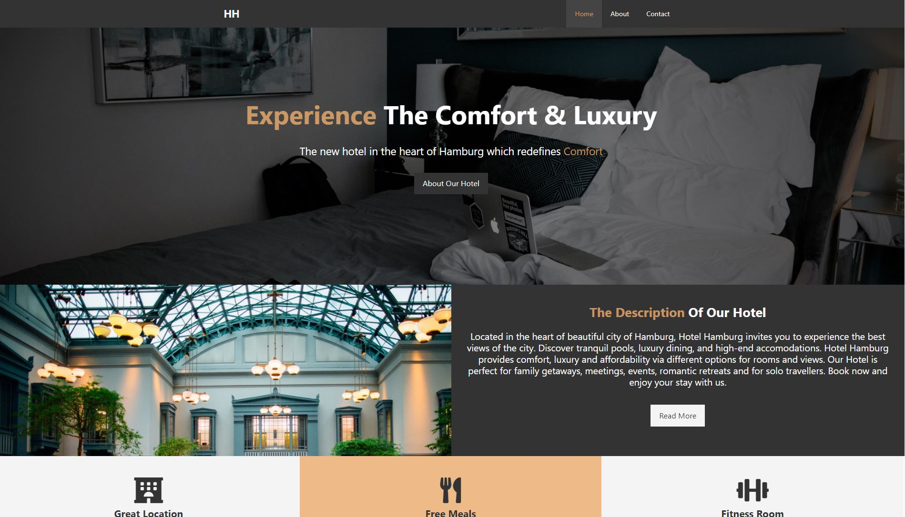
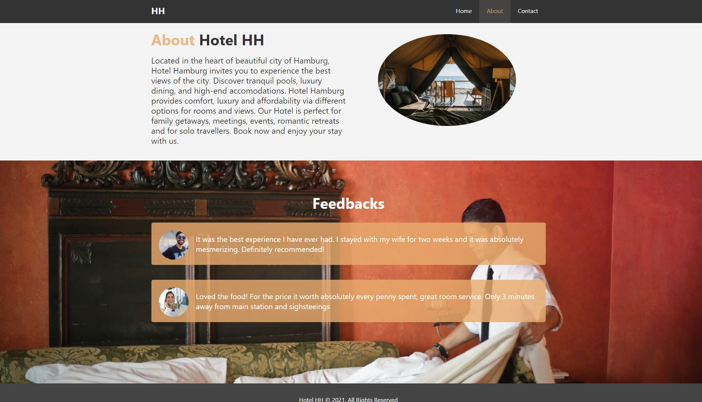
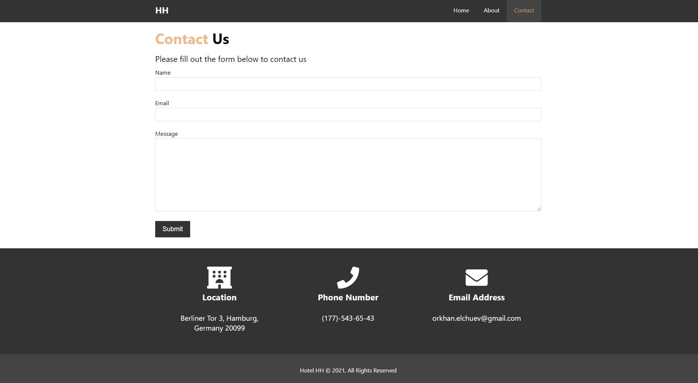

# Hotel-Website
### Hotel-Website with Home, About and Contact pages. This website is created using HTML and CSS styling via [Brad Traversy](https://www.udemy.com/course/modern-html-css-from-the-beginning/)'s Udemy course.

## Screenshots and detailed description
#### Home Page - Main page with functional links/buttons

#### About page - About page which includes description of hotel and reviews from customers

#### Contact page - Contact page with a simple form to submit and info

## Tools used while developing this project
- Visual Studio Code
- HTML
- CSS
- Gitbash

## Acknowledgements
- [pexels](https://www.pexels.com/)
- [fontawesome](https://fontawesome.com/)

## Contacts 
- E-mail address orkhan.elchuev@gmail.com
